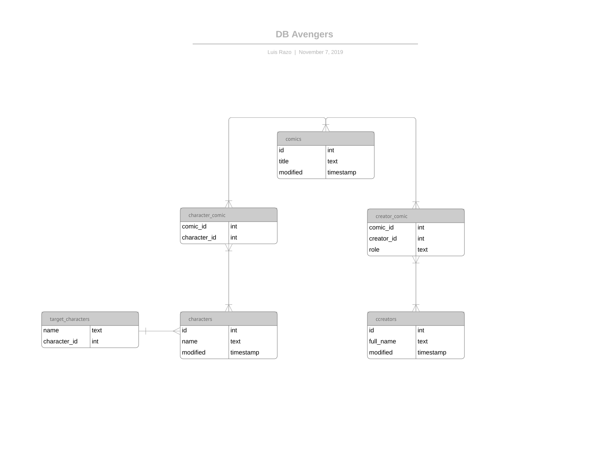
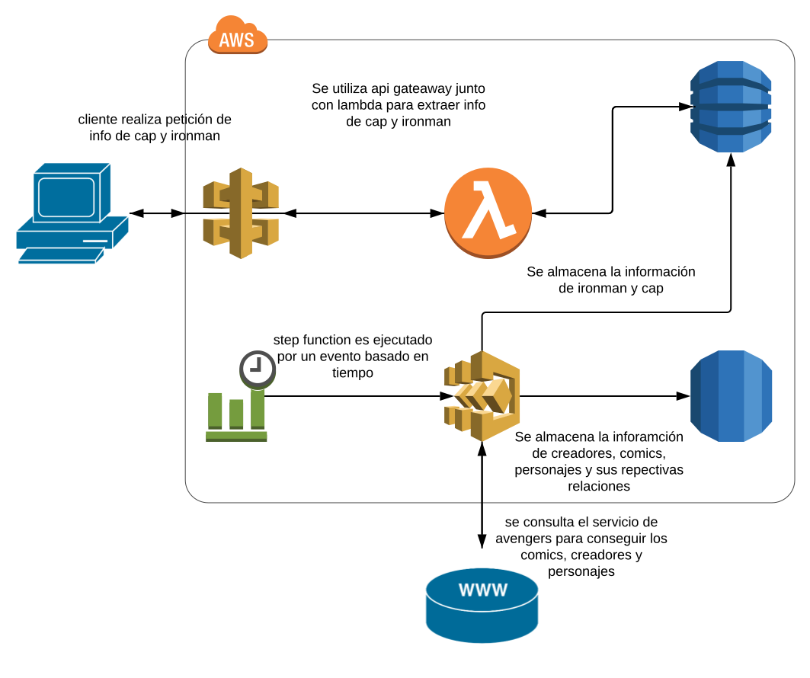
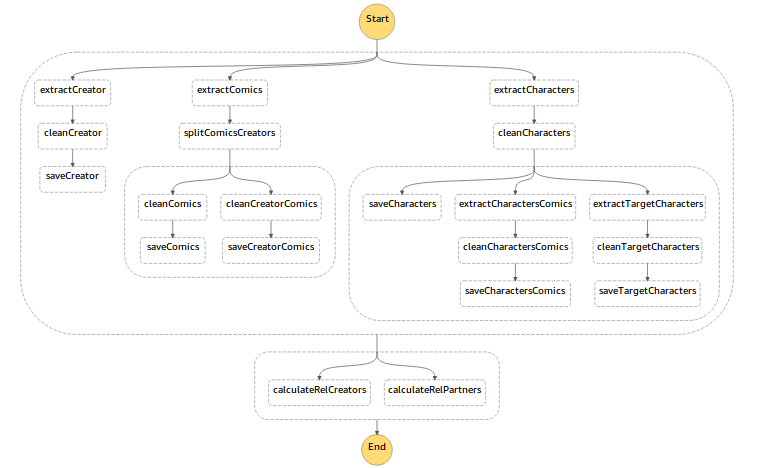
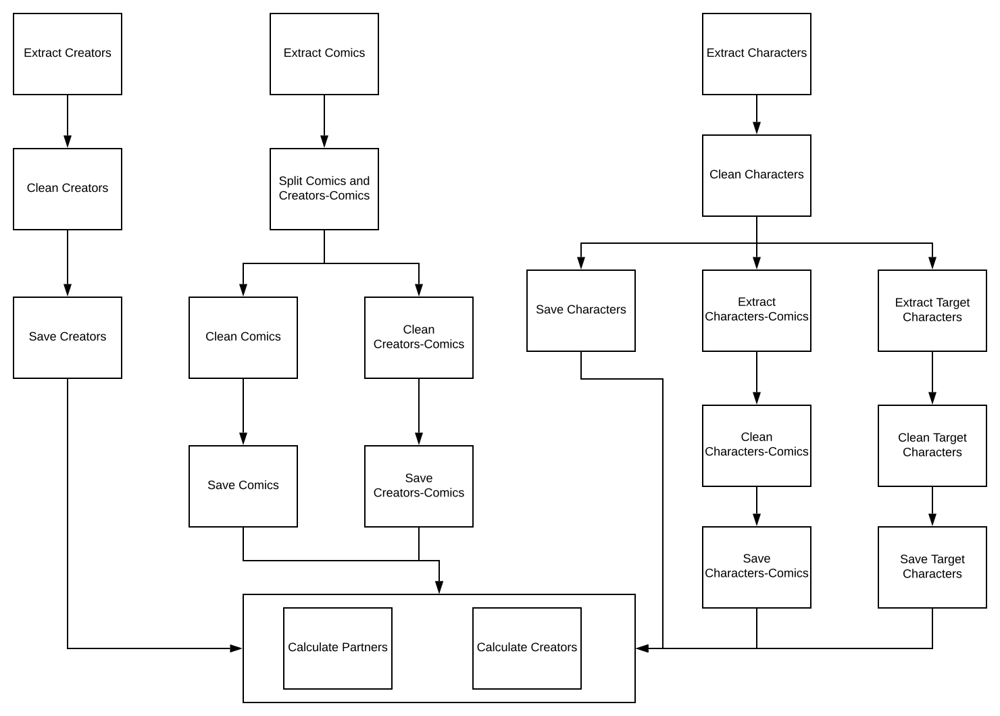

# avengers

Este proyecto sincroniza el api https://developer.marvel.com/, descarga un historico y hace sincronización diaria a las 0 hrs utc. Los datos se insertan en una db postgres aurora serverless después se hacen agregaciones para sacar stats de interes, los cuales son almacenados en dynamo db. Así simos se expone un api gateaway para que el cliente puede consultar los stats.
La estrucutura de la db es la siguiente:

El diagrama de la Infraestructura es el siguiente, se utilizo el servicio de nube AWS.


El diagrama ETL para la sicronización diaria es el siguiente


# Requisitos minimos
Para poder ejecutar el proyecto es necesario tener una cuenta en aws con los suficientes privilegios, crear un apikey en https://developer.marvel.com/, tener instalado awscli, python3 y virtualenv.

De permisos de ejecución al script avenger-assemble.sh

```chmod +x avenger-assemble.sh```

ejecute el comando 

```./avenger-assemble.sh```

Esto creara un stack y varios nested stacks en aws. Puede revisar el status de el proceso en la consola de aws.